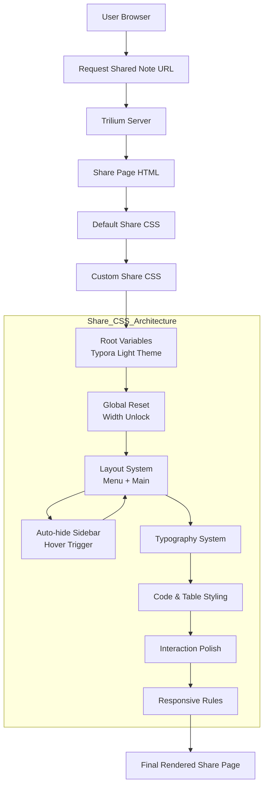

# Architecture & Flow
> This diagram shows the full rendering pipeline from browser request to Trilium share page,
> with the Share CSS treated as an independent styling architecture.

# Features
## English Description
| Category      | Feature                         | Description                                                                                       |
| ------------- | ------------------------------- | ------------------------------------------------------------------------------------------------- |
| Theme         | Typora-style Light Theme        | Recreates Typora classic light appearance with white background, dark gray text, and blue accents |
| Layout        | Width Unlock + Centered Reading | Removes Trilium width limits and keeps content centered at ~80% viewport width                    |
| Navigation    | Auto-hide Sidebar               | Sidebar collapses to a thin strip and expands smoothly on hover                                   |
| Layout        | Two-column Structure            | Left menu + right content area using Flexbox                                                      |
| Typography    | Typora-like Headings            | Gradient H1, accent-bar H2/H3 with clear hierarchy                                                |
| Code          | Light Code Blocks               | Soft gray code blocks with Typora-style syntax colors                                             |
| Tables        | Enhanced Tables                 | Zebra striping, hover highlight, horizontal scrolling                                             |
| Scrollbar     | Light Scrollbars                | Wide, light-themed scrollbars optimized for readability                                           |
| Compatibility | Style Override Friendly         | Key `!important` rules removed to preserve note-level custom styles                               |
| Responsive    | Mobile Adaptation               | Switches to vertical layout on small screens                                                      |

## Chinese Description
| 功能分类 | 功能点           | 说明                                |
| ---- | ------------- | --------------------------------- |
| 主题风格 | Typora 经典浅色风格 | 复刻 Typora 默认浅色主题：白色背景、深灰文字、蓝色强调   |
| 布局策略 | 宽度限制解除 + 居中阅读 | 解除 Trilium 默认宽度限制，正文约 80% 视口宽度并居中 |
| 目录导航 | 侧边栏自动隐藏       | 目录栏默认极窄显示，鼠标悬停自动展开                |
| 页面结构 | 双栏布局          | 左侧目录（Menu）+ 右侧正文（Main）            |
| 排版体系 | Typora 风格标题   | H1 渐变标题，H2/H3 左侧强调条，层级清晰          |
| 代码展示 | 浅色代码块         | 浅灰代码背景，Typora 风格配色，降低视觉负担         |
| 表格增强 | 表格斑马纹与悬停      | 支持斑马纹、行悬停高亮、横向滚动                  |
| 细节优化 | 浅色滚动条         | 加宽滚动条，适配浅色主题与触控操作                 |
| 兼容性  | 保留原笔记样式       | 刻意移除部分 `!important`，允许原笔记样式覆盖     |
| 响应式  | 移动端适配         | 小屏幕自动切换为纵向布局                      |

# install
1. copy a css file code
2. trilium create CSS note, and paste code
3. share root note add a New Relation: shareCss, isInheritable, value = CSS note
4. sync and new share css work!

# demo

## ATHidesideTypora

### default share view

### mouse move and auto expand sidebar view

### change chrome window width view

## ATHidesideBlack

### default share view

### mouse move and auto expand sidebar view

### change chrome window width view

